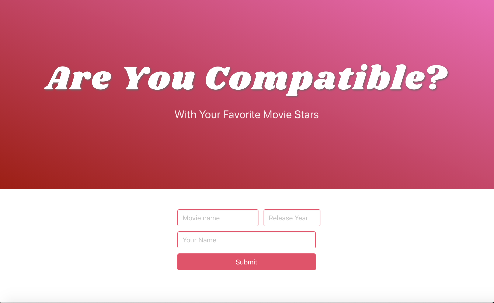
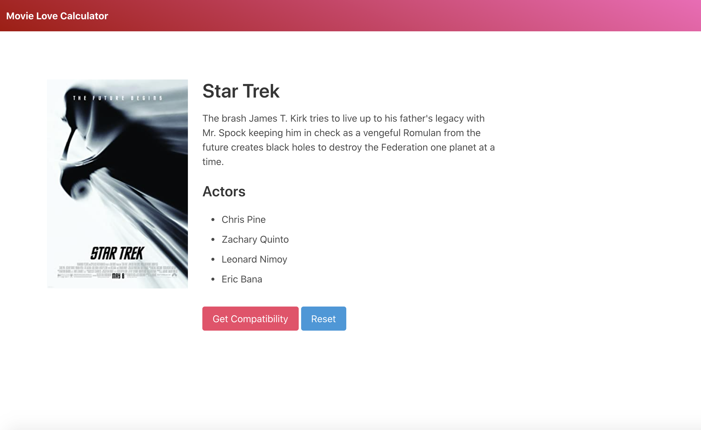
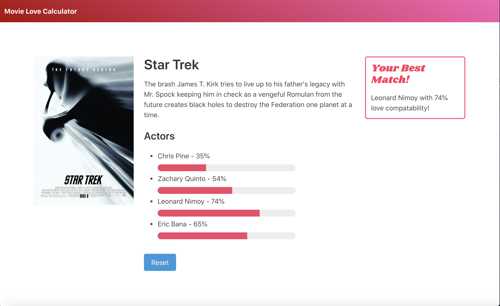
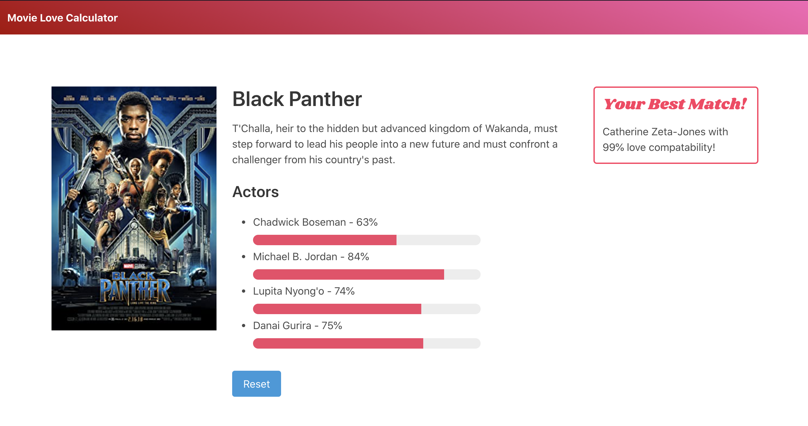

# Welcome to the Algo-Rythms "Movie Love Calculator Readme."

## Overview

We used the [OMDb API](http://www.omdbapi.com/) to do a relative movie search on any of your favorite movies througout the years and which one of the actors your likely get to go on a hot date with.  We then use the [Love Calculator API](https://rapidapi.com/ajith/api/love-calculator) to get your compatibility with all of those actors/actresses. 

Using the fetch statement we have created a responsive application that allows us to complete a search on any movie we choose to input.  

For our front end CSS purposes since we used an alternative that is Bulma a free open source and modern CSS framework. 

## Features
The app saves user name's best match across all movie searches for the given input name. 

### Inputs

The user inputs the following: 
* Title of the Movie 
* Your first name 
* Optional - Year of the Movie 

### Outputs

The application will diplay: 
*  Information of the movie, including poster, description, and actors 
*  When Get Compatibility is clicked
    *  It will display the % of compatibility that you have with the actors
    *  It will display the actor that you are most compatible with in your search history 
    *  It will hide the Get Compatibiity button so that the user must push reset for a new search 

### Link to the application 
https://alzcheng.github.io/project1/